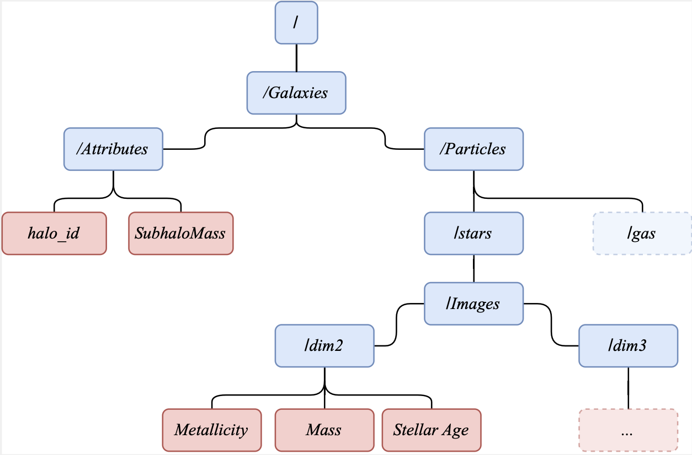

# MEGS: Morphological Evaluation of Galactic Structure
This project, developed by Ufuk Çakır, introduces the code generate the dataset and evaluate galaxy morphology using Principal Component Analysis.
The dataset offers detailed 2D maps and 3D cubes of 11 960 galaxies, capturing essential attributes: stellar age, metallicity, and mass. 

*Interdisciplinary Center for Scientific Computing (IWR), Heidelberg University, 09/2023*

## Table of Contents
1. [Download Dataset](#download-dataset)
2. [Installation](#installation)
3. [Configuration](#configuration)
4. [Generation](#generation)
5. [Data Structure](#data-structure)
6. [Loading Data](#loading-data)
7. [PCA Benchmark](#pca-benchmark)

## Download Dataset <a name="download-dataset"></a>

The dataset can be downloaded on [Zenodo](https://zenodo.org/record/8375344).

## Installation <a name="installation"></a>

The code loads galaxies from the [IllustrisTNG](https://www.tng-project.org/) suite. For that, the respective python package should be installed:

```
$ cd ~
$ git clone https://github.com/illustristng/illustris_python.git
$ pip install illustris_python/
```
Check the [Starting Guide](https://www.tng-project.org/data/docs/scripts/) on the TNG webpage for more information.

For installation of the code, run  
`source setup.sh`

## Configuration <a name="configuration"></a>

The [config.json](srcs/megs/config.json) file contains all the settings nedded to run the data generation. All the configuration should be made there.
The required fields are:
- simulation: The simluation from which the data should be generated. Currently only "IllustrisTNG" is supported.
- "particle_types": The particle type to calculate the images
- "galaxy_parameters": Additional parameters to be saved for each galaxy.
- "img_res": Image resolution in each dimension
- "path": Output Path of the Created HDF5 File
- "halo_ids": If none, it will do automatic selection of galaxies.
- "dim": dimension of image , either (2 and/or 3) dimensional
- "log_M_min": lower Mass cut in log10(M_sun/h)
- "log_M_max": upper Mass cut in log10(M_sun/h)
- "fields": Fields to calculate the images. For each field the attributes "mass_weighted" and "normed" define wheter or not to calculate a mass weighted image and to norm or not.
- "GalaxyArgs": Arguments specified to load galaxy defined in the [Galaxy Class](src/megs/data/galaxy.py)


## Generation <a name="generation"></a>
To generate the dataset run
`source generate_data.sh`

This will select galaxies using the [select_galaxies](src/megs/data/select_galaxies.py) function and save the halo ids in a numpy array.
Finaly the code runs the [generate.py](src/megs/data/generate.py) code to generate the dataset from the selected galaxies.

## Data Structure <a name="data-structure"></a>

The data will be stored in a HDF5 File in the following way:




## Loading Data <a name="loading-data"></a>
You can use the `Gamma`class defined in [load.py](src/megs/data/load.py):

```python
>>> from megs.data import Gamma
>>> path = "GAMMA.hdf5"

data = Gamma(path)
```

To get specific data from the Attributes group you can simply call

```python
>>> data = Gamma("GAMMA.hdf5")
>>> data.get_attribute("mass")  # Get the mass of all galaxies in the dataset
>>> data.get_attribute("mass", 10)  # Get the mass of the 10th galaxy in the dataset
```

To get the images you can use:

```python
>>> image = data.get_image("stars", "Masses", 10) # Get the stars masses image of the 10th galaxy in the dataset
>>> all_images = data.get_image("stars", "Masses") # Get all stars masses images in the dataset
```
## PCA Benchmark<a name="pca-benchmark"></a>
```python
>>> from megs.data import Gamma
>>> path = "GAMMA.hdf5"
>>> data = Gamma(path)
>>> from megs.model import mPCA
>>> model = mPCA(data, dim=2) # Initialize PCA model for two dimensional data
Creating datamatrix with the following fields:
 ===============================================
 Particle type:  stars
 Fields:  ['GFM_Metallicity', 'GFM_StellarFormationTime', 'Masses']
 Dimension:  dim2
 Default arguments are used for the fields that are not specified in the norm_function_kwargs
 ===============================================
 Created datamatrix with shape:  (11727, 12288) 
>>> model.fit(n_components = 60, show_results = True)
```


